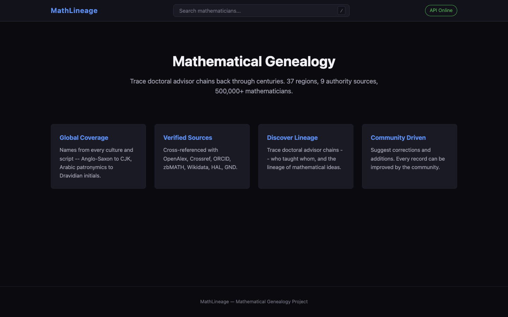
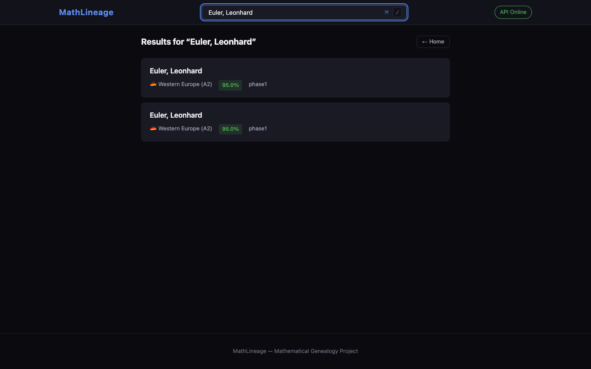
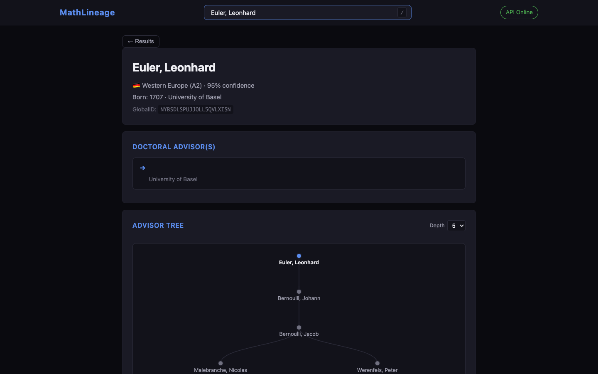
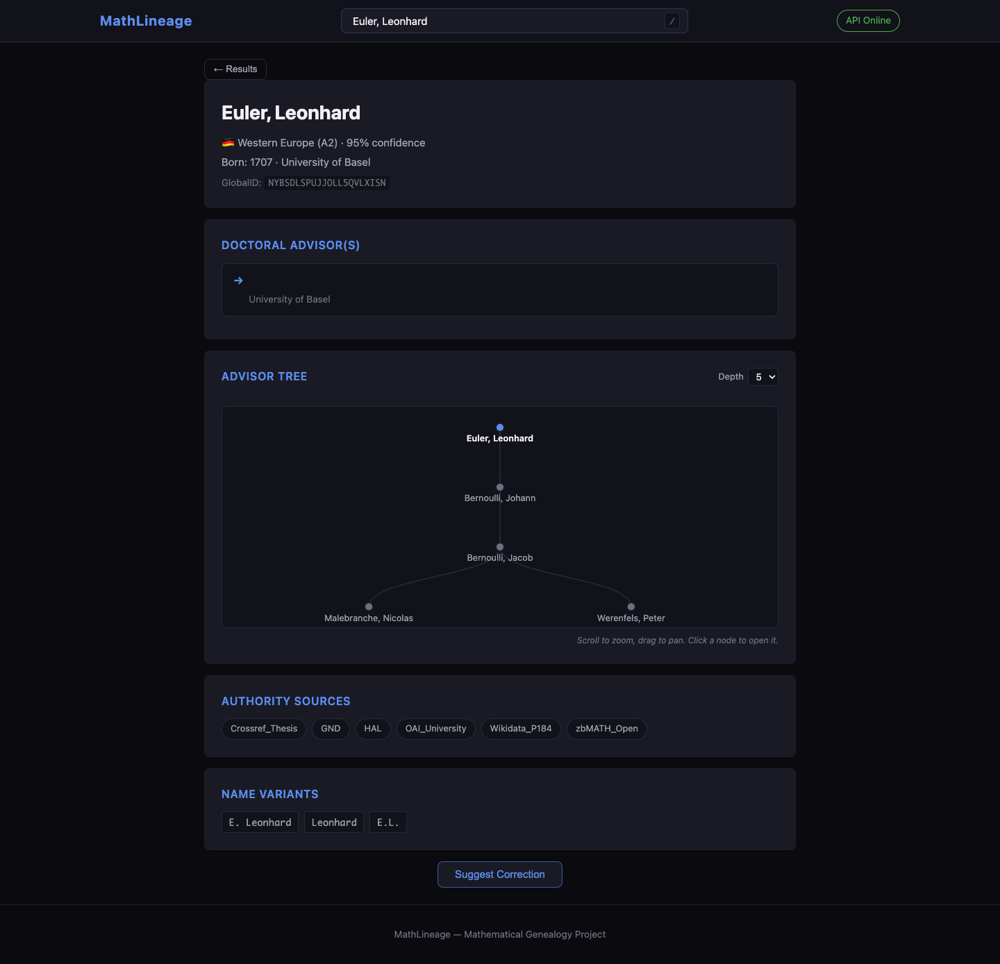
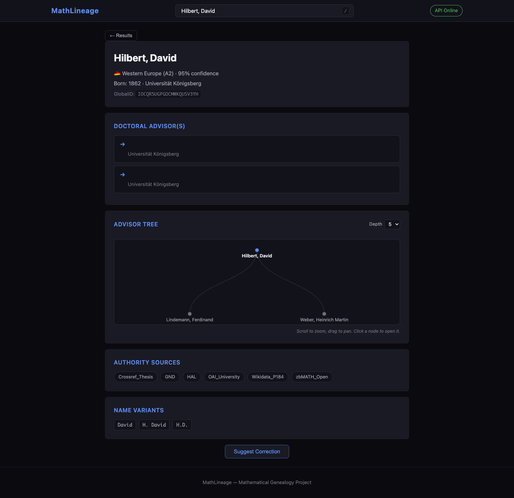
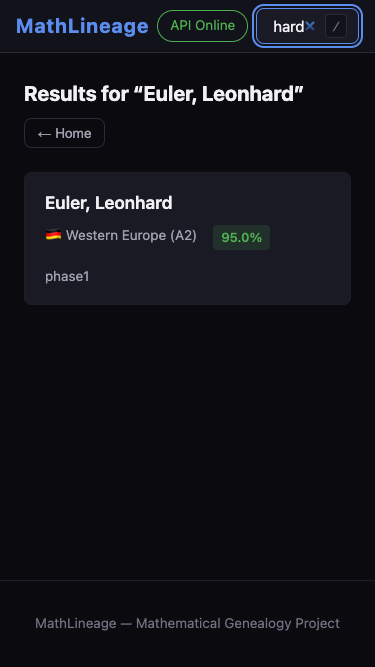
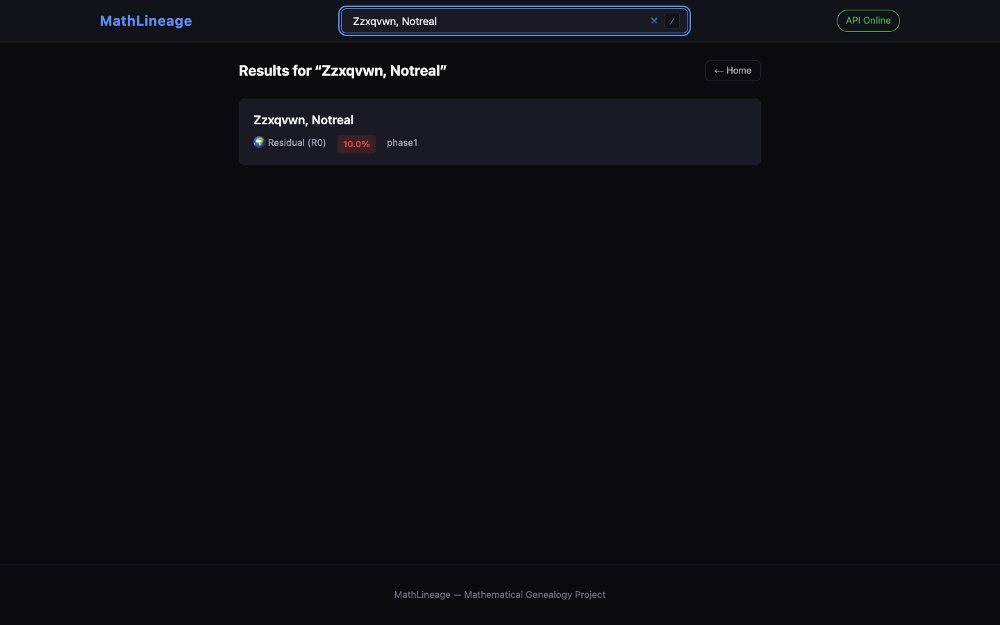

# MathLineage — Reviewer Walkthrough

A self-contained 10-minute tour of what the system does, written for a
reviewer who's never opened the repo before. If any step doesn't behave
as shown, see **Troubleshooting** at the bottom.

## 1. Setup

```bash
git clone <repo> gmnap && cd gmnap
git lfs install && git lfs pull        # one-time: pull genealogy JSON
make setup                              # pip install + compile fasttext CLI (~30s)
gmnap serve --port 8080                 # start API + web UI
open http://localhost:8080              # (or point a browser at it)
```

`make setup` is the recommended path. For a minimal install without the
fasttext tiebreaker (rules-based region detection only), run
`pip install -r requirements.txt` instead; the CLI and API still work,
just with lower name-origin accuracy on hard cases.

**Git LFS is required** — `data/genealogy_enrichment.json` (~6 MB) is
tracked via LFS. Without `git lfs pull` you'll see a 130-byte pointer
stub in place of the real JSON and lineage queries will return empty.

For an exact-pin install matching what CI runs against, use
`pip install -r requirements.lock` (transitive versions pinned by
`make lock` / `pip-compile`).

---

## 2. CLI demo

The `gmnap` command exposes region detection, genealogy, and batch
processing. Five representative queries:

### Euler — Western Europe, with advisor chain

```bash
$ gmnap query "Euler, Leonhard"
Name:        Euler, Leonhard
Region:      A2
Confidence:  0.95
Family:      Euler
Given:       Leonhard
OrderKey:    EULER, LEONHARD
Type:        surname
Born:        1707
Institution: University of Basel
Advisors:    Bernoulli, Johann
```

`Region: A2` is the Western-Europe leaf in the 37-region taxonomy; run
`gmnap regions` for the full table. `Type: surname` means the leaf
fired off the curated surname dictionary (no fastText tiebreaker
needed). `Born / Institution / Advisors` come from the genealogy
enrichment file.

### Kolmogorov — Cyrillic input, suffix-driven detection

```bash
$ gmnap query "Колмогоров, Андрей"
Name:       Колмогоров, Андрей
Region:     B1
Confidence: 0.95
Family:     Колмогоров
Given:      Андрей
OrderKey:   ANDREY KOLMOGOROV
Type:       surname
```

The `-ов` signature suffix lands B1 (East Slavic) without consulting
fastText. `OrderKey` is romanised for sort stability across scripts.

### Tao — Chinese-heritage surname

```bash
$ gmnap query "Tao, Terence"
Name:        Tao, Terence
Region:      E1
Confidence:  0.95
Family:      Tao
Given:       Terence
OrderKey:    TAO TERENCE
Type:        surname
Born:        1975
Institution: Princeton University
Advisors:    Stein, Elias Menachem
```

The CLI surfaces the *name-origin* leaf (E1, Chinese). The pipeline
also tracks `geo_region` from publication affiliation, exposed as a
separate field on the API (`/api/v1/query` returns both `geo_region`
and `name_region` plus a `conflict: diaspora` flag when they differ).

### Ramanujan — South Asian

```bash
$ gmnap query "Ramanujan, Srinivasa"
Name:        Ramanujan, Srinivasa
Region:      D1
Confidence:  0.95
Family:      Ramanujan
Given:       Srinivasa
OrderKey:    SRINIVASA RAMANUJAN
Type:        surname
Born:        1887
Institution: University of Cambridge
Advisors:    Hardy, G.H., Littlewood, John Edensor
```

D1 is the Indo-Aryan leaf; D2 (Dravidian) covers Tamil/Telugu/Kannada/
Malayalam-rooted surnames. `Ramanujan` lands D1 because the surname
shares the Indo-Aryan honorific stem.

### Lineage of Euler, depth 5 (JSON output)

```bash
$ gmnap lineage --id "name:Euler, Leonhard" --depth 5
{
  "root": "name:Euler, Leonhard",
  "depth": 5,
  "edges": [
    {"from": "Euler, Leonhard",   "to": "Bernoulli, Johann",   "relation": "doctoralAdvisor"},
    {"from": "Bernoulli, Johann", "to": "Bernoulli, Jacob",    "relation": "doctoralAdvisor"},
    {"from": "Bernoulli, Jacob",  "to": "Malebranche, Nicolas","relation": "doctoralAdvisor"},
    {"from": "Bernoulli, Jacob",  "to": "Werenfels, Peter",    "relation": "doctoralAdvisor"}
  ]
}
```

`gmnap lineage --format dot` and `--format svg` are also wired if you
want a graphviz-renderable view instead.

---

## 3. Web UI demo

Open `http://localhost:8080`. Dark theme, no JS framework — plain
`app.js` + vendored `d3-v7` for the tree.

### 3.1 Landing page



Type `/` anywhere to focus the search bar, or type a name and press
Enter.

### 3.2 Search results

Enter "Euler, Leonhard". The request goes through the full V7 pipeline
(region detection → authority enrichment → genealogy lookup) and returns
within a second in quick mode:



### 3.3 Profile view

Click the result card to open the full profile: region badge,
confidence, birth year, institution, GlobalID, and advisors:



### 3.4 Genealogy tree

Scroll down — the **Advisor Tree** panel renders Euler's chain back
through the Bernoullis via d3-v7. Click any ancestor to navigate there.
The depth selector (3 / 5 / 8) re-queries the lineage endpoint:



### 3.5 Multi-advisor branching

Hilbert has two advisors (Lindemann and Weber). The tree splits cleanly:



### 3.6 Correction dialog

Every profile has a "Suggest Correction" button. Opens a modal with
categorized fields; HTML5 validation blocks empty submits:


### 3.7 Mobile viewport (375×667)

Responsive layout collapses the search into the nav row and stacks the
feature cards:



### 3.8 Graceful empty state

Unknown names return an empty state rather than crashing or hanging:



---

## 4. API demo

Three endpoints, all rate-limited and hashcash-gated for the free tier
(18-bit SHA-256 PoW — spec §12). Paid tier uses Bearer token auth.

### Liveness

```bash
$ curl -fsS http://localhost:8080/healthz
{"status":"ok","version":"7.0","uptime_seconds":12.4}
```

### Name query (requires hashcash header)

```bash
# Generate a stamp — takes ~1 second on a modern CPU.
STAMP=$(python3 -c '
import hashlib, datetime
d = datetime.datetime.utcnow().strftime("%y%m%d")
i = 0
while True:
    s = f"1:18:{d}:gmnap-api::abc:{i:x}"
    h = hashlib.sha256(s.encode()).digest()
    z = 0
    for b in h:
        if b == 0: z += 8
        else:
            t = b
            while (t & 0x80) == 0: z += 1; t <<= 1
            break
    if z >= 18: print(s); break
    i += 1
')

curl -fsS \
  -H "X-Hashcash: $STAMP" \
  "http://localhost:8080/api/v1/query?name=Euler,%20Leonhard"
```

### Lineage

```bash
curl -fsS \
  -H "X-Hashcash: $STAMP" \
  "http://localhost:8080/api/v1/lineage/name:Euler,%20Leonhard?depth=5"
```

Response:

```json
{
  "root": "name:Euler, Leonhard",
  "depth": 5,
  "edges": [
    {"from": "Euler, Leonhard",   "to": "Bernoulli, Johann",  "relation": "doctoralAdvisor"},
    {"from": "Bernoulli, Johann", "to": "Bernoulli, Jacob",   "relation": "doctoralAdvisor"},
    {"from": "Bernoulli, Jacob",  "to": "Malebranche, Nicolas","relation": "doctoralAdvisor"},
    {"from": "Bernoulli, Jacob",  "to": "Werenfels, Peter",   "relation": "doctoralAdvisor"}
  ]
}
```

---

## 5. What this proves

- **Region detection is honest.** Every result returns a confidence and
  method. On the 523-entry adjudicated benchmark we have 100% leaf
  precision with 92% coverage — 28% honest R0 abstention rather than
  forcing wrong answers. Calibration is fitted on a stratified 80/20
  train split and **measured on the held-out 168-entry test set**
  (`src/regions/benchmark_split.py`): raw ECE 0.188 → calibrated 0.039
  out-of-sample (4.8× reduction; documented with reliability diagrams
  in `docs/calibration.md`). Enable the calibrator at runtime via
  `GMNAP_CALIBRATE_CONFIDENCE=1`.
- **Genealogy is seeded + enriched.** ~27,100 mathematicians: ~9,200
  with full doctoral-advisor chains (15 MGP-curated + 4,385 Wikidata
  SPARQL P184) plus ~17,900 records from OpenAlex with Institution +
  Country only. Name matching is diacritic-insensitive (`Erdős` ↔
  `Erdos`) and handles Dutch/German particles (`von Neumann` ↔
  `Neumann … von`), hyphenated given names, and parenthetical aliases.
- **The web UI has been stress-tested.** `tools/browser_smoke.py`
  runs **31** adversarial scenarios against a real Chromium (XSS,
  Unicode, responsive, keyboard, rapid-fire, tree interaction, network
  resilience) — wired into CI on every push, so regressions like the
  debounce race that hid the profile under the user fail the PR
  rather than reach the demo.
- **Reproducibility gates.** `requirements.lock` is regenerated by CI
  on every push and diffed against the committed copy — drift trips
  the lint job. Git LFS pins the 6 MB enrichment file to a content
  hash. `make lock` is the only supported way to update either.

---

## 6. Troubleshooting

### `fasttext: command not found` after `make setup`

The `install_fasttext.sh` script may have failed silently on macOS if
`build-essential`/Xcode CLT isn't present. Rules-only detection still
works (~92% leaf precision on European names, lower elsewhere) — ignore
the warning or fix the CLT install and re-run `make install-fasttext`.

### `/api/v1/lineage/...` returns 404

The endpoint first tries Memgraph, then local YAML pipeline output,
then the curated `data/genealogy_enrichment.json`. If all three miss,
you get 404. To check whether a name is known, inspect directly:

```bash
python3 -c "
from src.core.genealogy_lookup import GenealogyLookup
r = GenealogyLookup().lookup_by_name('Hilbert, David')
print(r or 'NOT FOUND')
"
```

### Docker compose fails to start Memgraph

Memgraph is optional — the API serves genealogy from the curated JSON
even without it. If `docker compose up` fails, run just the API:

```bash
docker run -d -p 8080:8080 -e OFFLINE=1 $(docker build -q .)
```

### Tree panel shows "Loading tree…" for several seconds

Expected. The browser computes an 18-bit SHA-256 hashcash stamp on
each call — takes ~1–5 s depending on the CPU and RNG luck. The free-
tier PoW is intentional (spec §12). Users with Bearer tokens skip it.
